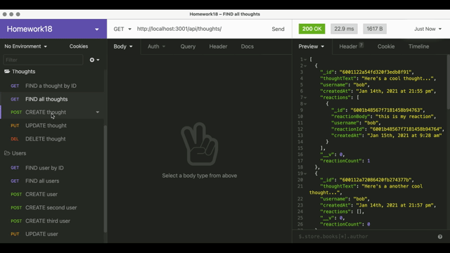

# social-media

## Description :page_with_curl:

This application features an API for a social network using Express.js for routing, a MongoDB database, and the Mongoose ODM. In addition to using the express and  mongoose packages,  a JavaScript date library of your choice used or the native JavaScript `Date` object to format timestamps.

## Images :camera_flash:

The following image shows the web application's appearance:

The walkthrough video demonstrates how to start the application’s server.

The second animation shows GET routes to return a single user and a single thought being tested in Insomnia Core:

The third animation shows the POST, PUT, and DELETE routes for users being tested in Insomnia Core:

Your walkthrough video shows the POST, PUT, and DELETE routes for thoughts being tested in Insomnia Core:

The animation shows the POST and DELETE routes for a user’s friend list being tested in Insomnia Core:

The walkthrough video demonstrates how to start the application’s server with `npm start` and the POST and DELETE routes for reactions to thoughts being tested in Insomnia Core:

## Technology Used :label: 

* express
* mongoose
* javascript
* node

## Resources Used :wrench: 

* [Express](https://www.npmjs.com/package/express)
* [Mongoose](https://www.npmjs.com/package/mongoose)
* [mongoose validation](https://mongoosejs.com/docs/validation.html)
* [understanding virtuals](https://futurestud.io/tutorials/understanding-virtuals-in-mongoose)
* [mongoose connection](https://mongoosejs.com/docs/connections.html#options)
* [mongoose queries](https://mongoosejs.com/docs/queries.html)
* [Validations](https://mongoosejs.com/docs/validation.html) or on [String Validators](https://mongoosejs.com/docs/schematypes.html#string-validators)
* [express-session](https://www.npmjs.com/package/express-session)
* [emoji-cheat-sheet:for readme](https://github.com/ikatyang/emoji-cheat-sheet)

## Installation :electric_plug:
* ` npm install mongoose`
* `npm i mongoose-unique-validator`
* `npm install --save-dev validator` 
* run `npm start` at the root of the directory to connect to the server

## Contribution :heavy_plus_sign: 

Contributions, issues and feature requests are welcome. 
Check out [issues page](https://github.com/MarynaPR/social-media/issues). 
Give :star: if you found this project useful. 

### Questions :question: 
Feel free to contact me with any questions via email :e-mail: pryadkamaryna@gmail.com. 
  
If you'd like to see my other projects, please visit my :octocat: 
[GitHub](https://github.com/MarynaPR?tab=repositories)